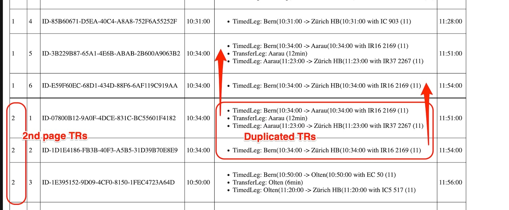

# TripsPagination

This project was generated with [Angular CLI](https://github.com/angular/angular-cli) version 16.2.4.

The app demonstrates pagination for the same TripRequest `from`/`to` endpoints
- for the initial request the current date is used
- for the next requests (pages) the last departure time is used
- TripRequest results which are duplicated can be discarded using a hash function for Trip/TripLeg components
example: see [app.component.ts > computeTripHash](./src/app/app.component.ts#L190-L213) method

Example: 
- results 1, 2 from 2nd page are duplicated (they match the results 5, 6 in first page)

## Development server

Run `ng serve` for a dev server. Navigate to `http://localhost:4200/`. The application will automatically reload if you change any of the source files.

## Code scaffolding

Run `ng generate component component-name` to generate a new component. You can also use `ng generate directive|pipe|service|class|guard|interface|enum|module`.

## Build

Run `ng build` to build the project. The build artifacts will be stored in the `dist/` directory.

## Running unit tests

Run `ng test` to execute the unit tests via [Karma](https://karma-runner.github.io).

## Running end-to-end tests

Run `ng e2e` to execute the end-to-end tests via a platform of your choice. To use this command, you need to first add a package that implements end-to-end testing capabilities.

## Further help

To get more help on the Angular CLI use `ng help` or go check out the [Angular CLI Overview and Command Reference](https://angular.io/cli) page.
